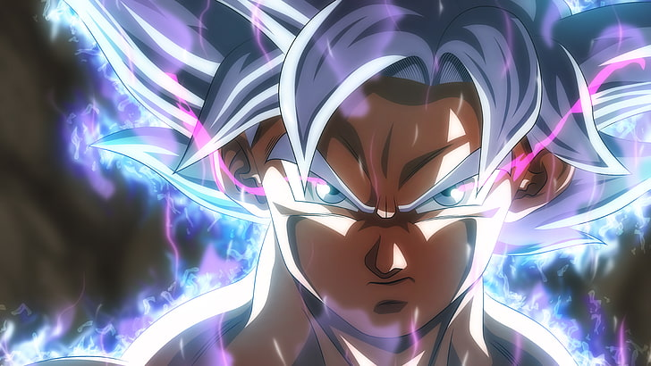

<div align="center">



# 🎌 Anime Recommendation System


[](https://anime-recommendation-system-vine.streamlit.app/)

</div>

---

## 📌 Project Overview

This project builds a **Content-Based Anime Recommendation System** using the Anime Recommendations Database from Kaggle. Given an anime title, the system recommends the most similar anime based.

---

## 📂 Repository Structure

```
├── app.py                  # Streamlit web app
├── code.ipynb              # Full analysis notebook
├── anime.csv               # Dataset (12,294 anime titles)
├── banner.png              # App banner image
└── requirements.txt        # Python dependencies
```

---

## 📊 Dataset

- **Source:** [Kaggle - Anime Recommendations Database](https://www.kaggle.com/datasets/CooperUnion/anime-recommendations-database/data)
- **Reference:** [Content & Collaborative Anime Recommendation](https://www.kaggle.com/code/benroshan/content-collaborative-anime-recommendation)
- **anime.csv** - 12,294 anime titles with genre, type, rating, members, episodes
- **rating.csv** - 7.8 million user ratings (not pushed - too large for deployment)

---

## 📓 Notebook - `code.ipynb`

Full step-by-step analysis across 4 assignment questions:

| Question | Description |
|---|---|
| **i**   | Load dataset - shape, dtypes, missing values, initial inspection |
| **ii**  | EDA - type distribution, top 20 popular & rated, rating distributions, genre analysis, members vs rating scatter, user activity |
| **iii** | Skewness check - log1p transformation on `members` and `episodes`, Q-Q plot on `avg_rating` |
| **iv**  | Content-Based Recommender - TF-IDF + OneHot + MinMax → Cosine Similarity → Top N recommendations with visualizations |

---

## 🤖 Recommender System

### How It Works

Each anime is represented as a **weighted feature vector**:

| Feature | Method | Weight |
|---|---|---|
| Genre | TF-IDF Vectorization | ×3 |
| Type | OneHot Encoding (TV/Movie/OVA/ONA/Special/Music) | ×2 |
| Avg Rating | MinMax Normalization | ×1 |
| Members | log1p + MinMax | ×1 |
| Episodes | log1p + MinMax | ×1 |

**Similarity:** Cosine Similarity computed on-demand per request (memory efficient; no 1.2GB precomputed matrix)

---

## 🚀 Streamlit App - `app.py`

Interactive web app with **2 tabs:**

| Tab | Content |
|---|---|
| 📋 Data Overview | Dataset metrics, first 10 rows, descriptive stats, missing values, model explanation |
| 🎌 Recommender | Search all 12,294 anime → selected anime card → Get Recommendations → similarity chart + rating chart + genre distribution + Quick Try buttons |

**Run locally:**
```bash
pip install -r requirements.txt
streamlit run app.py
```

---

## 🛠️ Tech Stack

| Category | Tools |
|---|---|
| Language | Python 3.10+ |
| Data Processing | pandas, numpy |
| Visualisation | matplotlib, seaborn |
| Machine Learning | scikit-learn, scipy |
| Web App | Streamlit |

---

## ✍️ Author

**Vineeth Muraleedharan**

Senior Radiation Therapist | Healthcare AI Developer


---

<div align="center">
<i>"In the ninja world, those who break the rules are scum, but those who abandon their friends are worse than scum."</i>
<br>- Kakashi Hatake
</div>
